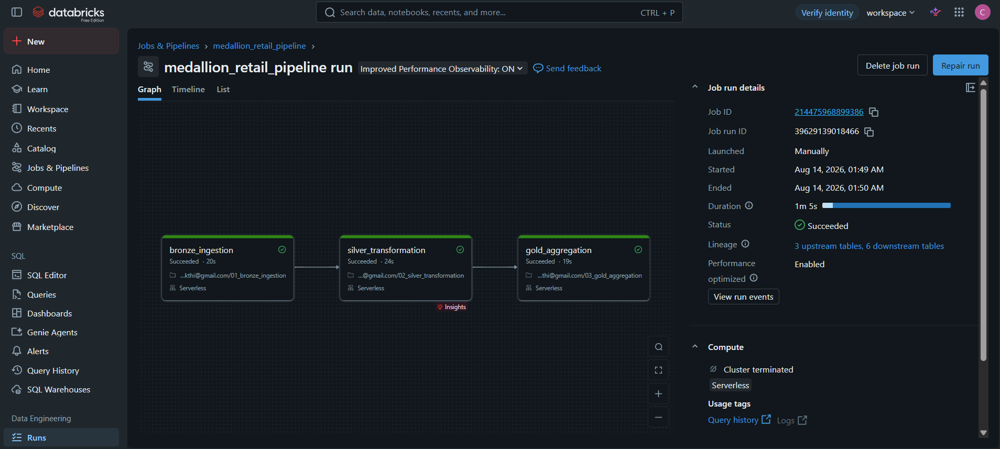
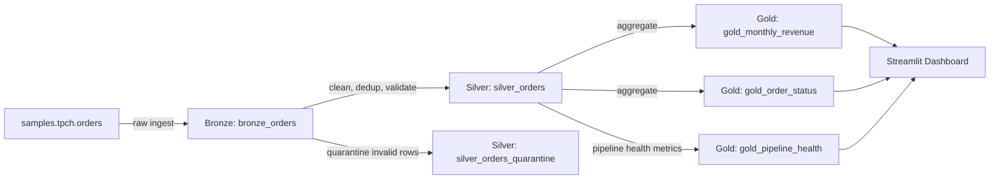
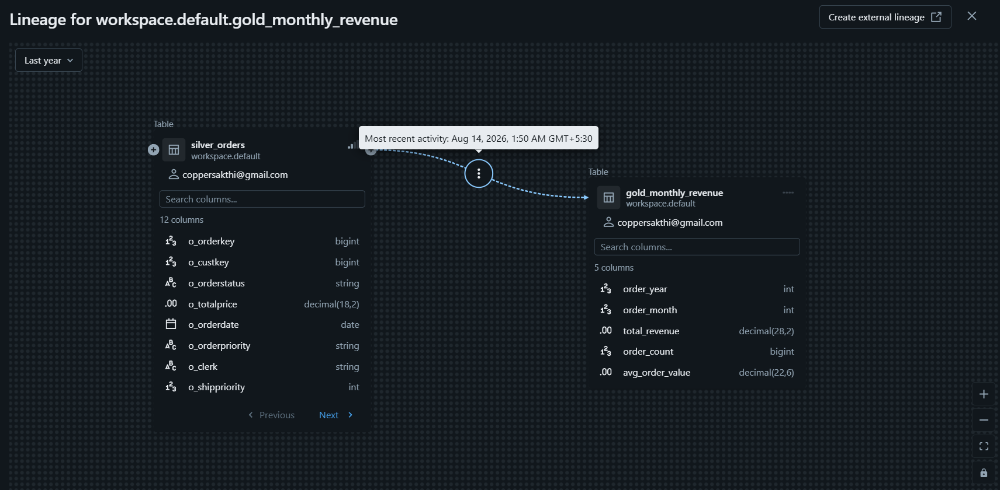

# Retail Medallion Pipeline

A production-style data pipeline that ingests raw retail order data and transforms it into analytics-ready tables using **Medallion Architecture** (Bronze → Silver → Gold) on **Databricks**, orchestrated as an automated job with built-in data quality checks and table lineage tracking.

**[Live Dashboard →](https://retailmedallionpipeline.streamlit.app/)**



## Problem

Raw transactional data is rarely analytics-ready — it needs deduplication, validation, and structuring before it can support reliable business reporting. This project simulates that real-world flow: ingesting raw order data, progressively refining it through validation and cleaning layers, and producing trustworthy, query-ready aggregate tables for downstream consumption.

## Architecture



**Bronze** — lands raw source data as-is, tagged with ingestion metadata (`_ingested_at`, `_source`). No transformation, just capture.

**Silver** — deduplicates on primary key, standardizes types and formats, and applies data quality filters. Records that fail validation are routed to a **quarantine table** rather than silently dropped, preserving visibility into data quality issues.

**Gold** — aggregates Silver data into business-facing tables: monthly revenue trends, order status breakdown, and a pipeline health summary (record counts across Bronze/Silver/Quarantine) that powers the dashboard's data quality view.

## Orchestration

All three layers run as a single **Databricks Job** with explicit task dependencies (`bronze_ingestion → silver_transformation → gold_aggregation`), so Silver only runs after Bronze succeeds, and Gold only after Silver succeeds. Scheduled to run daily.


## Data Lineage

Unity Catalog automatically tracks table-level lineage across all layers, from the original source table through to the final Gold outputs.



## Data Quality

Invalid records (null keys, non-positive prices, missing dates) are filtered out of `silver_orders` and written to `silver_orders_quarantine` instead of being discarded. The `gold_pipeline_health` table tracks record counts at each stage, making data quality measurable rather than assumed.

## Tech Stack

- **Databricks Free Edition** — serverless compute, Unity Catalog, Delta Lake
- **PySpark** — data transformation
- **Delta Lake** — storage format for all Bronze/Silver/Gold tables
- **Databricks Jobs** — orchestration and scheduling
- **Streamlit** — public-facing dashboard
- **Pandas** — data export/dashboard layer

## Repository Structure

```
retail-medallion-pipeline/
├── notebooks/
│   ├── 01_bronze_ingestion.py
│   ├── 02_silver_transformation.py
│   └── 03_gold_aggregation.py
├── data/
│   ├── gold_monthly_revenue.csv
│   ├── gold_order_status.csv
│   └── gold_pipeline_health.csv
├── dashboard/
│   └── app.py
├── screenshots/
│   ├── job_run_dag.png
│   └── lineage_graph.png
└── requirements.txt
```

## Running Locally

The dashboard reads from static CSV exports, so it can be run without any Databricks credentials:

```bash
git clone https://github.com/<your-username>/retail-medallion-pipeline.git
cd retail-medallion-pipeline
pip install -r requirements.txt
streamlit run dashboard/app.py
```

The Databricks notebooks (`notebooks/`) require a Databricks workspace to run against the `samples.tpch` dataset, and are included for reference/reproducibility.

## Future Improvements

- Add Great Expectations for schema-level validation in addition to row-level filters
- Add a streaming ingestion path (Kafka/Spark Structured Streaming) alongside the batch flow
- Migrate transformation logic to dbt for testable, documented modeling

## Author

Sakthivel — [LinkedIn](https://linkedin.com/in/sakthiveloffcl/) | [Portfolio](https://sakthivel07.vercel.app)
